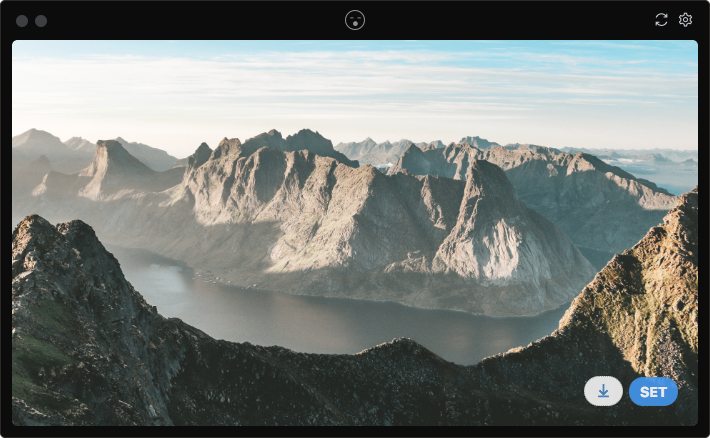

ranwall
====================================
Are you tired of your bored wallpaper :expressionless:?    
With ranwall you can discover more than millions wallpapers just doing a click :open_mouth:, if you liked any you can set it to your desktop with an other click. **EASY** :sunrise_over_mountains:! 

## Usage
Launch the app and see the random wallpaper, if you liked it click on 'set' button; if you liked it so much click on download :arrow_down: icon to save as image.
Oops you don't like it, well click on refresh button to try with another wallpaper.

###### Command
You can also change the wallpaper with a single command: (`Cmd+Shift+W` on MacOS, `Win+Shift+W` on Windows) but beware of the background you had before. 

## Download
Download latest version from [here](https://github.com/jaumesegarra/ranwall2-app/releases) (Only for Windows and macos at the moment)

## Thanks to:
* [picsum.photos](https://picsum.photos)
* [unsplash.com](https://unsplash.com)
* [desktoppr.co](https://www.desktoppr.co)
