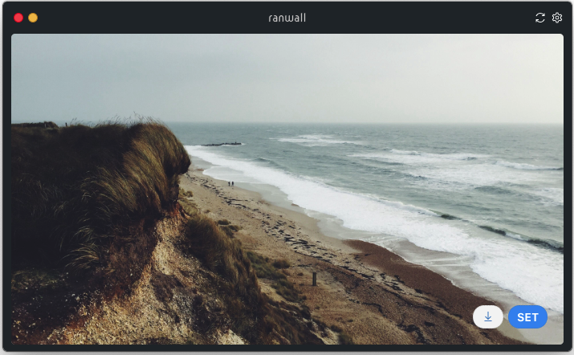

ranwall
====================================
Are you tired of your bored wallpaper :expressionless:? <br /> <br />
With ranwall you can discover more than millions wallpapers just doing a click :open_mouth:, if you liked any you can set it to your desktop with an other click. **EASY** :sunrise_over_mountains:! 



## Usage
Launch the app and see the random wallpaper, if you liked it click on 'set' button; if you liked it so much click on download :arrow_down: icon to save as image.
Oops you don't like it, well click on refresh button to try with another wallpaper.

###### Command
You can also change the wallpaper with a single command: (`Cmd+Shift+W` on MacOS, `Win+Shift+W` on Windows) but beware of the background you had before. 

###### Custom Providers
**WARNING**: This feature is experimental and insecure because the file described below executes javascript code within the app itself. Anyone could access the file and modify it with malicious code.

For this reason the use of methods within the file has been limited, for example: window, require, document, alert, etc ...

---

Now you can define your own providers based in a json file. Steps:

**1.** Enable this option (Configuration -> Advanced options -> Custom providers) marking this checkbox. 

**2.** Open the config. file (click in the button "OPEN FILE").

**3.** Write the provider configuration inside the `[]`, for example:
```javascript
{
	"code": "UNSNATU",
	"name": "unsplash.com: Nature",
	"url": res => `https://source.unsplash.com/random/${res[0]}x${res[1]}?nature,water`,
	"get": {
		"type": "image"
	}
}
```
**Note**: Code must be unique.

If the response will be return as json, set `"type": "json"` and create new property on "get" similar to:

```javascript
"imgPath": data => {
	return data.wallpaper.url_image
}
```
Paving the way to access to the download url of image.

If bearer token is required reate new property on "get" similar to:

```javascript
"auth": {
   "bearer": "BEARER_HERE"
}
```

## Download
Download latest version from [here](https://github.com/jaumesegarra/ranwall2-app/releases) (Only for Windows and macos at the moment)

## Thanks to:
* [picsum.photos](https://picsum.photos)
* [unsplash.com](https://unsplash.com)
* [desktoppr.co](https://www.desktoppr.co)
* [loremFlickr.com](https://loremFlickr.com) 
* [splashbase.co](http://www.splashbase.co) 
